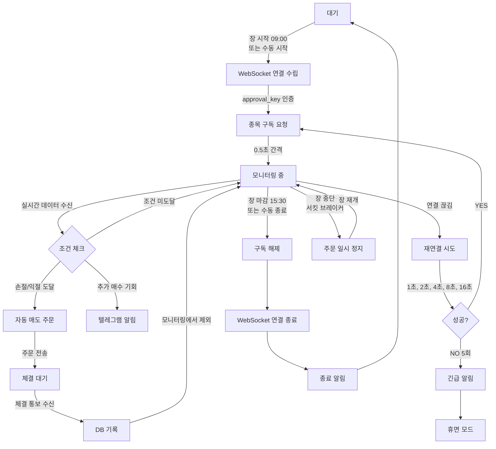

# Phase 3: 실시간 모니터링 사용자 여정

## 1. 개요

### 목표

보유 종목과 감시 리스트 종목을 실시간으로 모니터링하여 손절/익절 조건 도달 시 자동으로 매도 주문을 실행하고, 연결 장애 시 안전하게 복구하는 시스템 구현

### 사용자 (Actor)

- **자동화 시스템**: 스케줄러가 장 시작 시 자동 시작
- **트레이더 (수동)**: CLI 또는 API를 통한 수동 시작/중지
- **KIS WebSocket**: 실시간 시세 데이터 제공자

### 시작점

1. **자동 시작**: 스케줄러가 09:00에 자동 트리거
2. **수동 시작**: CLI 명령 `hantu monitor start` 또는 API 호출
3. **주문 체결 후**: Phase 2 종목 매수 체결 시 실시간 모니터링에 추가

### 종료점

1. **정상 종료**: 장 마감 (15:30) 후 모든 구독 해제 및 연결 종료
2. **비정상 종료**: 연결 복구 5회 실패 후 휴면 모드 진입
3. **긴급 종료**: 사용자 수동 중지 명령 (`hantu monitor stop`)

### 예상 소요

- **모니터링 시간**: 09:00~15:30 (6시간 30분)
- **초기 구독**: 20-30개 종목 × 0.5초 = 10-15초
- **재연결**: 최대 5회 × 지수 백오프 (1초~16초) = 최대 31초

---

## 2. 여정 플로우

### 2.1 전체 흐름도 (Mermaid)



### 2.2 상태 다이어그램 (ASCII)

```
[대기] ─┐
        │ (장 시작/수동 시작)
        ↓
[WebSocket 연결 수립] ←─────────────┐
        │                          │
        │ (approval_key 인증)       │
        ↓                          │
[종목 구독 중] ───→ [구독 완료]     │
   (0.5초 간격)        │           │
                       ↓           │
                  [모니터링 중] ────┤
                       │           │
        ┌──────────────┼───────────┴──┐
        │              │              │
        ↓              ↓              ↓
    [조건 도달]    [연결 끊김]    [장 마감]
        │              │              │
        ↓              ↓              ↓
   [주문 실행]    [재연결 시도]  [구독 해제]
        │              │              │
        ↓         ┌────┴────┐         ↓
   [체결 대기]    │ 성공/실패 │  [연결 종료]
        │         └────┬────┘         │
        ↓              │              ↓
   [체결 확인] ←───YES─┘          [대기]
        │              NO (5회)
        ↓              ↓
   [모니터링 중]   [긴급 알림]
                       │
                       ↓
                  [휴면 모드]
```

---

## 3. 단계별 상세 정의

### 단계 1: WebSocket 연결 수립

**사용자 상태**

- 보이는 것: 로그 메시지 "WebSocket 연결 시도..."
- 할 수 있는 것: 연결 진행 상황 모니터링 (로그)
- 기대하는 것: 빠른 연결 수립 (1-2초 내)

**시스템 상태**

- 데이터: approval_key (REST 토큰과 별도)
- 처리: WebSocket 연결 (`websockets.connect()`)
- 로딩: Ping 30초 간격 설정

**전환 조건**
| 조건 | 다음 단계 |
|------|----------|
| 연결 성공 | 단계 2: 종목 구독 요청 |
| 인증 실패 | 에러 처리: approval_key 재발급 |
| 네트워크 에러 | 에러 처리: 재연결 시도 |

**예외 상황**
| 예외 | 처리 방법 |
|------|----------|
| approval_key 없음 | APIConfig.get_ws_approval_key() 자동 발급 |
| 네트워크 타임아웃 | 재연결 시도 (최대 5회) |
| 서버 점검 | 텔레그램 알림 + 휴면 모드 |

---

### 단계 2: 종목 구독 요청

**사용자 상태**

- 보이는 것: 로그 "구독 요청 전송: H0STCNT0 - 005930", "구독 완료: 20/30"
- 할 수 있는 것: 구독 진행률 확인
- 기대하는 것: 순차적으로 안정적인 구독 (0.5초 간격)

**시스템 상태**

- 데이터:
  - 보유 종목 리스트 (TradingEngine.positions)
  - 감시 리스트 (Phase 2 선정 종목)
- 처리:
  - 각 종목에 대해 TR_ID 전송 (H0STCNT0, H0STASP0, H0STCNI0/9)
  - 0.5초 간격 (rate limit 준수)
- 로딩: 20-30개 종목 × 0.5초 = 10-15초

**전환 조건**
| 조건 | 다음 단계 |
|------|----------|
| 전체 구독 완료 | 단계 3: 실시간 모니터링 |
| 일부 구독 실패 | 실패 종목만 재시도 (3회) |
| Rate limit 초과 | 0.5초 대기 후 재시도 |

**예외 상황**
| 예외 | 처리 방법 |
|------|----------|
| 특정 종목 구독 실패 | 로그 기록 + 해당 종목 건너뛰기 + 계속 |
| 연결 끊김 | 재연결 프로세스 시작 |
| 데이터 파싱 오류 | 로그 기록 + 해당 메시지 무시 |

---

### 단계 3: 실시간 모니터링 (핵심 단계)

**사용자 상태**

- 보이는 것:
  - 로그: "체결가 수신: 005930 - 현재가 65,000원"
  - 텔레그램 알림: "⚠️ 손절 조건 도달: 삼성전자 (005930)"
- 할 수 있는 것: 실시간 가격 변동 모니터링, 수동 중지
- 기대하는 것:
  - 조건 도달 시 즉각적인 자동 실행 (1초 이내)
  - 안정적인 연결 유지

**시스템 상태**

- 데이터:
  - 메모리 버퍼 (실시간 체결가, 호가)
  - 손절/익절 조건 (TradingEngine.Position)
- 처리:
  - WebSocket 메시지 수신 (`websocket.recv()`)
  - JSON 파싱 및 TR_ID 라우팅
  - 조건 체크 (현재가 vs 손절가/익절가)
- 로딩:
  - 실시간 처리 (지연 1초 미만)
  - 메모리 버퍼 자동 정리 (1분 이상 된 데이터)

**전환 조건**
| 조건 | 다음 단계 |
|------|----------|
| 손절 조건 도달 | 단계 4: 자동 매도 주문 (손절) |
| 익절 조건 도달 | 단계 4: 자동 매도 주문 (익절) |
| 추가 매수 기회 | 단계 5: 텔레그램 알림 (수동 확인) |
| 연결 끊김 | 단계 6: 재연결 시도 |
| 장 마감 | 단계 7: 구독 해제 |
| 서킷 브레이커 | 단계 8: 주문 일시 정지 |

**예외 상황**
| 예외 | 처리 방법 |
|------|----------|
| 메시지 파싱 오류 | 로그 기록 + 해당 메시지 무시 + 계속 |
| 데이터 지연 (1초 이상) | 경고 로그, 5초 이상 시 알림 |
| 메모리 부족 | 오래된 버퍼 데이터 삭제 (1분 이상) |
| DB 저장 실패 (신호 발생 시) | 재시도 3회 → 실패 시 로그 + 계속 |

---

### 단계 4: 자동 매도 주문 실행

**사용자 상태**

- 보이는 것:
  - 로그: "자동 매도 주문 전송: 005930 수량 10주 @ 64,500원 (손절)"
  - 텔레그램: "📉 자동 매도 체결 - 삼성전자 손절: -2.3%"
- 할 수 있는 것: 체결 확인 대기
- 기대하는 것:
  - 즉시 주문 전송 (1초 이내)
  - 체결 통보 수신

**시스템 상태**

- 데이터:
  - Position 정보 (종목코드, 수량, 평균단가)
  - 현재가 (실시간 WebSocket 데이터)
  - 매도 사유 (손절/익절)
- 처리:
  - `KISAPI.place_order()` 호출 (매도, 지정가)
  - TradeJournal 기록
  - 텔레그램 알림 전송
- 로딩: 주문 전송 (1초 이내)

**전환 조건**
| 조건 | 다음 단계 |
|------|----------|
| 주문 성공 | 단계 4-1: 체결 대기 |
| 주문 실패 | 에러 처리: 재시도 가능하면 1회 재시도 |
| 네트워크 에러 | 에러 처리: 긴급 알림 + 로그 |

**예외 상황**
| 예외 | 처리 방법 |
|------|----------|
| KIS API 에러 (잔고 부족) | 텔레그램 알림 + 로그 + 건너뛰기 |
| KIS API 에러 (재시도 가능) | 1회 재시도 → 실패 시 알림 |
| 주문 타임아웃 | 긴급 알림 + 수동 확인 요청 |

---

### 단계 4-1: 체결 대기 및 확인

**사용자 상태**

- 보이는 것:
  - 로그: "체결 통보 대기 중: 005930"
  - 텔레그램: "✅ 체결 완료: 삼성전자 64,500원 × 10주"
- 할 수 있는 것: 체결 상태 확인
- 기대하는 것: 빠른 체결 통보 (수초 내)

**시스템 상태**

- 데이터:
  - 주문 ID (place_order 응답)
  - 체결 통보 TR_ID (H0STCNI0/9)
- 처리:
  - WebSocket으로 체결 통보 수신
  - DB에 거래 기록 저장 (SelectionResult 업데이트)
  - 모니터링 종목에서 제외
- 로딩: 체결 통보 수신 (실시간, 수초 내)

**전환 조건**
| 조건 | 다음 단계 |
|------|----------|
| 체결 통보 수신 | 단계 3: 실시간 모니터링 (계속) |
| 미체결 (1분 초과) | 경고 알림 + 수동 확인 요청 |
| 부분 체결 | 잔여 수량 재주문 또는 유지 |

**예외 상황**
| 예외 | 처리 방법 |
|------|----------|
| 체결 통보 미수신 (1분) | 경고 로그 + 잔고 조회로 확인 |
| DB 저장 실패 | 재시도 3회 → 실패 시 로그 + 계속 |

---

### 단계 5: 추가 매수 기회 알림

**사용자 상태**

- 보이는 것:
  - 텔레그램: "🔔 추가 매수 기회: 삼성전자 (005930) - 지지선 근접"
- 할 수 있는 것: 수동 매수 결정
- 기대하는 것: 기회 정보 확인

**시스템 상태**

- 데이터: 감시 리스트 종목 분석 결과
- 처리: Phase 2 추가 매수 조건 체크
- 로딩: 실시간 (조건 충족 시 즉시)

**전환 조건**
| 조건 | 다음 단계 |
|------|----------|
| 알림 전송 완료 | 단계 3: 실시간 모니터링 (계속) |
| 사용자 수동 매수 | (별도 플로우, 이 여정 밖) |

---

### 단계 6: 재연결 시도 (에러 복구)

**사용자 상태**

- 보이는 것:
  - 로그: "WebSocket 연결 끊김 감지 - 재연결 시도 1/5"
  - 텔레그램: "⚠️ WebSocket 연결 실패 (5회) - 휴면 모드 진입"
- 할 수 있는 것: 재연결 진행 상황 모니터링
- 기대하는 것:
  - 자동 복구 (31초 이내)
  - 5회 실패 시 안전한 종료

**시스템 상태**

- 데이터: 재시도 횟수 (max 5회)
- 처리:
  - 지수 백오프 (1초, 2초, 4초, 8초, 16초)
  - `KISWebSocketClient.connect()` 재호출
  - 성공 시 기존 구독 복구
- 로딩: 최대 31초 (1+2+4+8+16)

**전환 조건**
| 조건 | 다음 단계 |
|------|----------|
| 재연결 성공 | 단계 2: 종목 구독 요청 (복구) |
| 5회 실패 | 단계 6-1: 긴급 알림 + 휴면 모드 |

**예외 상황**
| 예외 | 처리 방법 |
|------|----------|
| 인증 실패 | approval_key 재발급 시도 |
| 서버 점검 | 텔레그램 알림 + 휴면 모드 |

---

### 단계 6-1: 긴급 알림 및 휴면 모드

**사용자 상태**

- 보이는 것:
  - 텔레그램: "🚨 긴급: WebSocket 연결 복구 실패 - 수동 확인 필요"
  - 로그: "휴면 모드 진입 - 수동 재시작 대기 중"
- 할 수 있는 것: 수동 재시작 (`hantu monitor restart`)
- 기대하는 것: 관리자 개입

**시스템 상태**

- 데이터: 휴면 모드 플래그
- 처리:
  - 텔레그램 긴급 알림
  - 모든 구독 해제 시도 (연결 가능하면)
  - 수동 재시작 대기
- 로딩: 없음 (대기 상태)

**전환 조건**
| 조건 | 다음 단계 |
|------|----------|
| 수동 재시작 | 단계 1: WebSocket 연결 수립 |
| 장 마감 | 단계 7: 구독 해제 |

---

### 단계 7: 구독 해제 (정상 종료)

**사용자 상태**

- 보이는 것:
  - 로그: "장 마감 - 모든 구독 해제 중"
  - 텔레그램: "⏹️ 실시간 모니터링 종료 - 오늘 성과: +1.2%"
- 할 수 있는 것: 종료 로그 확인
- 기대하는 것: 깔끔한 종료

**시스템 상태**

- 데이터: 구독 종목 리스트
- 처리:
  - 각 종목에 대해 unsubscribe() 호출
  - WebSocket 연결 종료
  - 일일 성과 요약 알림
- 로딩: 10-15초 (구독 해제)

**전환 조건**
| 조건 | 다음 단계 |
|------|----------|
| 모든 구독 해제 완료 | 단계 7-1: 연결 종료 |

---

### 단계 7-1: WebSocket 연결 종료 및 대기

**사용자 상태**

- 보이는 것:
  - 로그: "WebSocket 연결 종료 완료 - 다음 장 시작까지 대기"
  - 텔레그램: "✅ 오늘 모니터링 완료 - 내일 09:00 재시작"
- 할 수 있는 것: 로그 확인
- 기대하는 것: 안전한 종료

**시스템 상태**

- 데이터: 없음
- 처리:
  - `websocket.close()`
  - 메모리 버퍼 정리
  - 다음 장 시작까지 대기 상태
- 로딩: 없음

**전환 조건**
| 조건 | 다음 단계 |
|------|----------|
| 다음 날 09:00 | 단계 1: WebSocket 연결 수립 |
| 수동 시작 | 단계 1: WebSocket 연결 수립 |

---

### 단계 8: 장 중단 처리 (서킷 브레이커)

**사용자 상태**

- 보이는 것:
  - 텔레그램: "⚠️ 장 중단 (서킷 브레이커) - 주문 일시 정지"
  - 로그: "장 중단 이벤트 수신 - 대기 모드"
- 할 수 있는 것: 장 재개 대기
- 기대하는 것: 안전한 대기 및 재개

**시스템 상태**

- 데이터: 장 중단 플래그
- 처리:
  - 모든 주문 실행 일시 정지
  - 실시간 데이터 수신 계속 (모니터링만)
  - 장 재개 이벤트 대기
- 로딩: 없음 (대기 상태)

**전환 조건**
| 조건 | 다음 단계 |
|------|----------|
| 장 재개 이벤트 | 단계 3: 실시간 모니터링 (재개) |
| 장 마감 | 단계 7: 구독 해제 |

---

## 4. 상태 전이 매트릭스

| From → To       | 연결 수립 | 구독 중 | 모니터링 중 | 주문 실행 | 체결 대기 | 재연결 | 구독 해제 | 대기 | 휴면 | 장 중단 |
| --------------- | --------- | ------- | ----------- | --------- | --------- | ------ | --------- | ---- | ---- | ------- |
| **연결 수립**   | -         | ✓       | -           | -         | -         | ✓      | -         | -    | -    | -       |
| **구독 중**     | -         | -       | ✓           | -         | -         | ✓      | -         | -    | -    | -       |
| **모니터링 중** | -         | -       | -           | ✓         | -         | ✓      | ✓         | -    | -    | ✓       |
| **주문 실행**   | -         | -       | -           | -         | ✓         | -      | -         | -    | -    | -       |
| **체결 대기**   | -         | -       | ✓           | -         | -         | -      | -         | -    | -    | -       |
| **재연결**      | ✓         | -       | -           | -         | -         | -      | -         | -    | ✓    | -       |
| **구독 해제**   | -         | -       | -           | -         | -         | -      | -         | ✓    | -    | -       |
| **대기**        | ✓         | -       | -           | -         | -         | -      | -         | -    | -    | -       |
| **휴면**        | ✓         | -       | -           | -         | -         | -      | ✓         | -    | -    | -       |
| **장 중단**     | -         | -       | ✓           | -         | -         | -      | ✓         | -    | -    | -       |

---

## 5. 에러 처리 전략

### 5.1 에러 유형별 처리

| 에러 유형            | 심각도  | 처리 방법                                                      | 사용자 피드백                                                                        | 복구 시간 |
| -------------------- | ------- | -------------------------------------------------------------- | ------------------------------------------------------------------------------------ | --------- |
| **네트워크 단절**    | 🟡 중간 | 5회 재시도 (지수 백오프 1초~16초) → 실패 시 긴급 알림 + 휴면   | 텔레그램: "⚠️ WebSocket 연결 실패 (5회) - 수동 확인 필요"                            | 최대 31초 |
| **인증 실패**        | 🔴 높음 | approval_key 재발급 시도 → 실패 시 알림 + 중단                 | 텔레그램: "🔑 인증 실패: approval_key 확인 필요"                                     | 즉시      |
| **구독 실패**        | 🟡 중간 | 해당 종목만 3회 재시도 → 실패 시 건너뛰기 + 로그               | 로그: "종목 [005930] 구독 실패 (3회) - 건너뛰기"                                     | 1.5초     |
| **메시지 파싱 오류** | 🟢 낮음 | 오류 로그 + 해당 메시지 무시 + 계속                            | 로그: "메시지 파싱 실패: [원본 메시지]"                                              | 즉시      |
| **주문 실패**        | 🔴 높음 | KIS 에러 코드 확인 → 재시도 가능하면 1회 재시도 → 실패 시 알림 | 텔레그램: "❌ 주문 실패: [에러 메시지]"                                              | 1초       |
| **데이터 지연**      | 🟡 중간 | 1초 이상 지연 시 경고 로그 → 5초 이상 시 알림                  | 로그: "데이터 지연: [지연 시간]ms"<br/>텔레그램 (5초+): "⚠️ 실시간 데이터 지연 감지" | N/A       |
| **메모리 부족**      | 🟡 중간 | 1분 이상 된 버퍼 데이터 자동 삭제 + 계속                       | 로그: "메모리 정리: 버퍼 [N]개 삭제"                                                 | 즉시      |
| **DB 저장 실패**     | 🟡 중간 | 재시도 3회 → 실패 시 로그 + 계속                               | 로그: "거래 기록 저장 실패 (3회): [에러]"                                            | 3초       |
| **Rate limit 초과**  | 🟢 낮음 | 0.5초 대기 후 재시도                                           | 로그: "Rate limit 대기 중"                                                           | 0.5초     |
| **체결 통보 미수신** | 🟡 중간 | 1분 대기 → 잔고 조회로 확인 → 미체결 시 알림                   | 텔레그램: "⚠️ 체결 미확인: [종목명] - 수동 확인 필요"                                | 1분       |

### 5.2 재시도 전략 (지수 백오프)

```python
# 재연결 시도 스케줄
retry_delays = [1, 2, 4, 8, 16]  # 초 단위
max_retries = 5

for retry_count in range(1, max_retries + 1):
    try:
        await reconnect()
        break  # 성공
    except Exception as e:
        logger.error(f"재연결 실패 ({retry_count}/{max_retries}): {e}")
        if retry_count == max_retries:
            # 5회 실패 → 긴급 알림 + 휴면 모드
            send_emergency_alert()
            enter_sleep_mode()
        else:
            await asyncio.sleep(retry_delays[retry_count - 1])
```

### 5.3 에러 로깅 상세 정보

모든 에러는 다음 정보를 포함하여 로깅:

```python
logger.error(
    f"에러 발생: {error_type}",
    exc_info=True,
    extra={
        'error_code': error_code,           # 에러 코드 (KIS API 에러 코드 등)
        'stock_code': stock_code,           # 관련 종목 (해당 시)
        'retry_count': retry_count,         # 재시도 횟수
        'timestamp': datetime.now().isoformat(),
        'context': {
            'current_price': current_price,
            'stop_loss': stop_loss,
            'position_quantity': quantity
        }
    }
)
```

---

## 6. 알림 정책

### 6.1 텔레그램 알림 우선순위

| 우선순위      | 상황                                  | 예시                                | 알림 설정         |
| ------------- | ------------------------------------- | ----------------------------------- | ----------------- |
| **emergency** | 시스템 장애, 연결 5회 실패, 주문 실패 | "🚨 긴급: WebSocket 연결 복구 실패" | 즉시, 소리 ON     |
| **high**      | 손절/익절 체결, 장 시작/종료          | "📉 손절 체결: 삼성전자 -2.3%"      | 즉시              |
| **normal**    | 추가 매수 기회, 일일 성과 요약        | "🔔 추가 매수 기회: 삼성전자"       | 배치 (5분 간격)   |
| **low**       | 구독 완료, 재연결 성공                | "✅ 구독 완료: 20개 종목"           | 로그만 (알림 OFF) |

### 6.2 알림 타이밍

| 이벤트             | 알림 타이밍          | 내용                                                      |
| ------------------ | -------------------- | --------------------------------------------------------- |
| **모니터링 시작**  | 09:00 (장 시작 시)   | "🚀 실시간 모니터링 시작 - 20개 종목 구독 완료"           |
| **손절/익절 체결** | 체결 즉시 (1초 이내) | "📉 손절 체결: 삼성전자 (005930) -2.3% / 64,500원 × 10주" |
| **추가 매수 기회** | 조건 충족 즉시       | "🔔 추가 매수 기회: 삼성전자 - 지지선 근접 (60,000원)"    |
| **연결 끊김**      | 재시도 시작 시       | "⚠️ WebSocket 연결 끊김 - 재연결 시도 중"                 |
| **재연결 성공**    | 재연결 완료 시       | "✅ WebSocket 재연결 성공 - 모니터링 재개"                |
| **5회 실패**       | 5회 실패 즉시        | "🚨 긴급: WebSocket 연결 복구 실패 - 수동 확인 필요"      |
| **장 중단**        | 중단 이벤트 수신 시  | "⚠️ 장 중단 (서킷 브레이커) - 주문 일시 정지"             |
| **장 마감**        | 15:30 종료 시        | "⏹️ 실시간 모니터링 종료 - 오늘 성과: +1.2% (3승 1패)"    |

### 6.3 알림 메시지 템플릿

#### 손절 체결 알림

```
📉 *손절 체결*

종목: {stock_name} ({stock_code})
매도가: {exit_price:,.0f}원
매수가: {entry_price:,.0f}원
수량: {quantity:,}주

실현손실: {pnl:,.0f}원
수익률: {return_rate:.2%}
보유기간: {hold_days}일
```

#### 익절 체결 알림

```
💰 *익절 체결*

종목: {stock_name} ({stock_code})
매도가: {exit_price:,.0f}원
매수가: {entry_price:,.0f}원
수량: {quantity:,}주

실현수익: {pnl:,.0f}원
수익률: +{return_rate:.2%}
보유기간: {hold_days}일
```

#### 연결 실패 긴급 알림

```
🚨 *긴급: WebSocket 연결 복구 실패*

재시도: 5회 실패
마지막 시도: {last_retry_time}

⚠️ **영향**:
- 실시간 모니터링 중단
- 손절/익절 자동 실행 불가

🔧 **조치 필요**:
1. 네트워크 상태 확인
2. KIS API 서버 상태 확인
3. 수동 재시작: `hantu monitor restart`

📋 **현재 보유 종목**: {position_count}개
```

#### 일일 성과 요약 (장 마감)

```
⏹️ *실시간 모니터링 종료*

📊 **오늘의 매매 결과**:
- 총 거래: {total_trades}건
- 실현 손익: {total_pnl:,.0f}원
- 승률: {win_rate:.1%} ({wins}승 {losses}패)
- 평균 수익: {avg_win:,.0f}원
- 평균 손실: {avg_loss:,.0f}원

🔄 **보유 종목**: {position_count}개
{position_list}

⏰ **다음 모니터링**: 내일 09:00
```

---

## 7. 성능 및 제약사항

### 7.1 성능 목표

| 항목                 | 목표                     | 측정 방법                       |
| -------------------- | ------------------------ | ------------------------------- |
| **연결 수립**        | 1-2초 이내               | `websocket.connect()` 응답 시간 |
| **종목 구독**        | 0.5초/종목 (20개 = 10초) | 구독 시작 ~ 완료 시간           |
| **데이터 수신 지연** | 1초 이내                 | 체결 시각 ~ 수신 시각 차이      |
| **조건 체크 → 주문** | 1초 이내                 | 조건 도달 ~ 주문 전송 시간      |
| **재연결 복구**      | 31초 이내 (5회 재시도)   | 연결 끊김 ~ 재연결 완료 시간    |
| **메모리 사용량**    | 100MB 이하               | 버퍼 데이터 + WebSocket 연결    |

### 7.2 제약사항

| 제약                      | 값    | 근거                                |
| ------------------------- | ----- | ----------------------------------- |
| **최대 동시 구독 종목**   | 100개 | KIS WebSocket API 제한 (추정)       |
| **구독 요청 간격**        | 0.5초 | Rate limit 준수                     |
| **재연결 최대 시도**      | 5회   | 합리적인 복구 시도 + 빠른 장애 감지 |
| **데이터 버퍼 보관 기간** | 1분   | 메모리 효율성                       |
| **체결 대기 타임아웃**    | 1분   | 미체결 시 수동 확인 필요            |
| **DB 저장 재시도**        | 3회   | DB 장애 시에도 모니터링 계속        |

### 7.3 확장성 고려사항

- **수평 확장**: WebSocket 연결은 단일 프로세스만 가능 (KIS API 제약)
- **수직 확장**: 메모리 부족 시 버퍼 정리 로직으로 해결
- **장애 격리**: WebSocket 장애가 Phase 1/2에 영향 없도록 독립 실행

---

## 8. 데이터 저장 정책

### 8.1 메모리 버퍼 (실시간 처리)

**저장 대상**: 실시간 체결가, 호가 데이터
**저장 형식**: Python dict (메모리)
**보관 기간**: 1분 (이후 자동 삭제)
**크기 제한**: 100MB

```python
# 메모리 버퍼 구조 (예시)
realtime_buffer = {
    "005930": {
        "price": 65000,
        "timestamp": "2026-02-01T10:30:15",
        "volume": 1000,
        "ask_price": 65100,
        "bid_price": 64900
    },
    # ... 최대 100개 종목
}
```

### 8.2 DB 저장 (영구 기록)

**저장 시점**:

1. 손절/익절 신호 발생 시
2. 주문 체결 시
3. 일일 성과 요약 시 (장 마감)

**저장 테이블**: `SelectionResult` 업데이트

```sql
UPDATE selection_results
SET
    exit_price = {exit_price},
    exit_time = {exit_time},
    realized_pnl = {pnl},
    realized_return = {return_rate},
    exit_reason = '{stop_loss|take_profit}',
    is_executed = true
WHERE stock_code = '{stock_code}' AND selection_date = CURRENT_DATE;
```

**저장 실패 처리**:

- 재시도 3회
- 실패 시 로그 기록 + 모니터링 계속
- 일일 성과 요약 시 재저장 시도

---

## 9. 테스트 시나리오

### 9.1 정상 시나리오

| 시나리오             | 단계                                                                                         | 예상 결과                      |
| -------------------- | -------------------------------------------------------------------------------------------- | ------------------------------ |
| **장 시작 모니터링** | 1. 09:00 스케줄 트리거<br/>2. WebSocket 연결<br/>3. 20개 종목 구독<br/>4. 실시간 데이터 수신 | 10-15초 내 모니터링 시작       |
| **손절 자동 실행**   | 1. 삼성전자 -3% 하락<br/>2. 손절 조건 도달<br/>3. 자동 매도 주문<br/>4. 체결 통보 수신       | 1초 내 주문 전송, 수초 내 체결 |
| **익절 자동 실행**   | 1. SK하이닉스 +8% 상승<br/>2. 익절 조건 도달<br/>3. 자동 매도 주문<br/>4. 체결 통보 수신     | 1초 내 주문 전송, 수초 내 체결 |
| **장 마감 종료**     | 1. 15:30 장 마감<br/>2. 모든 구독 해제<br/>3. 연결 종료<br/>4. 일일 성과 알림                | 10-15초 내 종료                |

### 9.2 예외 시나리오

| 시나리오                  | 단계                                                                                     | 예상 결과                 |
| ------------------------- | ---------------------------------------------------------------------------------------- | ------------------------- |
| **네트워크 일시 단절**    | 1. WiFi 끊김<br/>2. 재연결 시도 (1초 대기)<br/>3. WiFi 복구<br/>4. 재연결 성공           | 1초 내 자동 복구          |
| **5회 재연결 실패**       | 1. 네트워크 완전 차단<br/>2. 재연결 시도 5회<br/>3. 긴급 알림<br/>4. 휴면 모드           | 31초 후 휴면 모드 진입    |
| **주문 실패 (잔고 부족)** | 1. 손절 조건 도달<br/>2. 매도 주문 시도<br/>3. KIS API 에러 (잔고 부족)<br/>4. 알림 전송 | 에러 로그 + 텔레그램 알림 |
| **구독 부분 실패**        | 1. 20개 종목 구독 시도<br/>2. 3개 종목 실패<br/>3. 재시도 3회<br/>4. 17개 종목만 구독    | 실패 종목 로그 + 계속     |
| **서킷 브레이커**         | 1. 장 중단 이벤트<br/>2. 주문 일시 정지<br/>3. 모니터링 계속<br/>4. 장 재개 후 주문 재개 | 안전한 대기 및 재개       |

---

## 10. 구현 우선순위

### Phase 3-1: 핵심 모니터링 (P0)

- [ ] WebSocket 연결 및 종목 구독
- [ ] 실시간 데이터 수신 및 메모리 버퍼 관리
- [ ] 손절/익절 조건 체크
- [ ] 자동 매도 주문 실행
- [ ] 체결 통보 수신 및 DB 기록

### Phase 3-2: 안정성 강화 (P1)

- [ ] 재연결 로직 (지수 백오프)
- [ ] 에러 처리 및 로깅
- [ ] 텔레그램 알림 (손절/익절, 긴급)
- [ ] 메모리 관리 (버퍼 자동 정리)

### Phase 3-3: 고급 기능 (P2)

- [ ] 추가 매수 기회 감지 및 알림
- [ ] 서킷 브레이커 대응
- [ ] 일일 성과 요약
- [ ] CLI 명령 (`hantu monitor start/stop/status`)

### Phase 3-4: 최적화 (P3)

- [ ] 성능 모니터링 (데이터 지연 감지)
- [ ] 로그 레벨 최적화
- [ ] 메모리 사용량 최적화

---

## 11. 다음 단계 위임

### 여정 설계 완료 → 비즈니스 로직 정의 필요

```
---DELEGATION_SIGNAL---
TYPE: DELEGATE_TO
TARGET: define-business-logic
REASON: 실시간 모니터링의 비즈니스 규칙 정의 필요
CONTEXT: |
  Phase 3 사용자 여정 설계 완료

  다음 비즈니스 규칙 정의 필요:
  1. 손절/익절 조건 계산 로직 (동적 vs 고정)
  2. 추가 매수 조건 (감시 리스트 종목)
  3. 재연결 정책 (지수 백오프 파라미터)
  4. 메모리 버퍼 관리 정책 (보관 기간, 크기 제한)
  5. DB 저장 재시도 정책 (횟수, 간격)
  6. 텔레그램 알림 우선순위 및 타이밍
  7. 서킷 브레이커 대응 정책

  핵심 의사결정 필요 사항:
  - ATR 기반 동적 손절/익절 vs 고정 비율 (TradingConfig에 이미 정의됨)
  - 추가 매수 조건 (Phase 2 점수 기준? 지지선 근접?)
  - 메모리 버퍼 크기 (현재 100MB 가정)
---END_SIGNAL---
```
